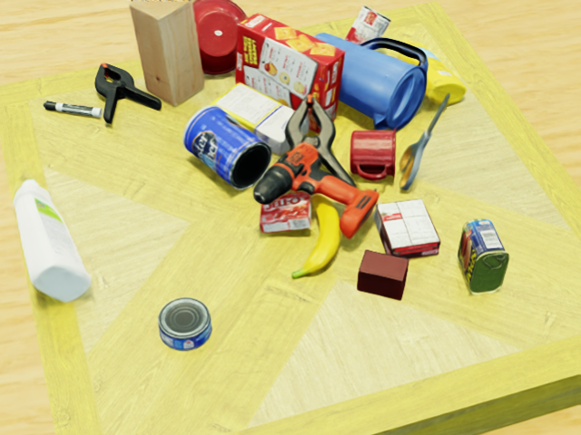

# IsaacSim数据集生成工具

这是一个基于NVIDIA Isaac Sim的数据集生成工具，用于生成类似YCB-Video数据集格式的6D位姿估计训练数据。

## 功能特点

- 支持批量转换3D模型(obj/glb)为USD格式
- 随机生成物体位姿、光照条件和材质
- 多视角相机拍摄
- 自动生成实例分割mask
- 输出标准化的位姿和边界框标注

## 安装步骤

1. 安装NVIDIA Isaac Sim和Isaac Lab（推荐使用binary文件安装Sim）
2. 克隆本仓库到本地
3. 确保Python环境中已安装相关依赖

## 使用方法

### 1. 模型转换

首先需要将3D模型转换为Isaac Sim可用的USD格式：

```bash
python convert_mesh_batch.py [输入模型目录] [输出USD目录]
```

参数说明：
- `输入模型目录`: 包含obj/glb模型的目录
- `输出USD目录`: 转换后USD文件的保存目录

### 2. 数据生成

运行主程序生成数据集：

```bash
python render.py --enable_cameras --headless
```

程序会自动：
- 加载USD模型
- 随机生成场景
- 渲染图像
- 保存数据

### 3. 数据后处理

处理生成的原始数据：

```bash
python extract.py # 默认生成"相机在物体坐标系下的位姿"，可修改extract.py中的矩阵求逆部分
```

将生成以下格式的数据：
- `export/rgb/`: RGB图像
- `export/mask_visib/`: 实例分割mask
- `export/train_gt.json`: 6D位姿标注
- `export/train_gt_info.json`: 边界框标注

## 数据格式

### 位姿标注(train_gt.json)
```json
{
    "图像ID": [
        {
            "cam_R_m2c": [旋转矩阵(9个元素)],
            "cam_t_m2c": [平移向量(3个元素)],
            "obj_id": 物体类别ID
        },
        ...
    ]
}
```

### 边界框标注(train_gt_info.json)
```json
{
    "图像ID": [
        {
            "bbox_visib": [x_min, y_min, width, height]
        },
        ...
    ]
}
```

## 生成数据示例




## 注意

- 对于定制相机内参、场景等需求，可修改`render.py`中的参数/函数
- 请确保USD模型的尺寸和单位与场景匹配
- 请仔细确认所需数据集是`物体在相机坐标系下的位姿`还是`相机在物体坐标系下的位姿`，开源数据集中两种标注方式都有